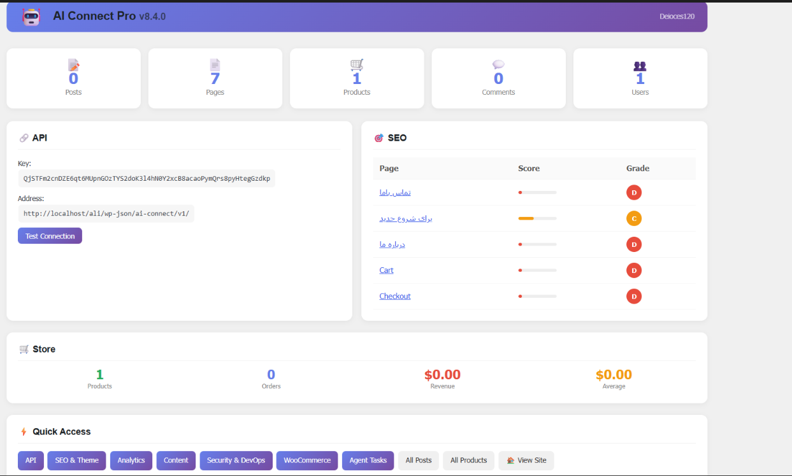
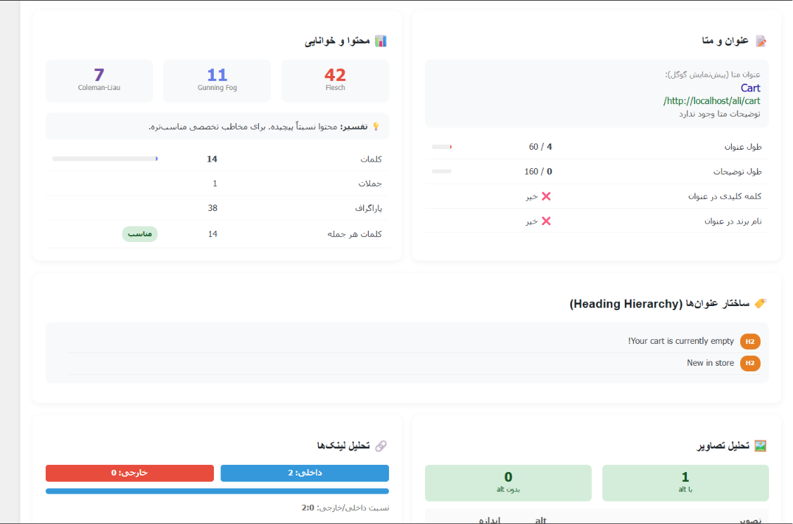
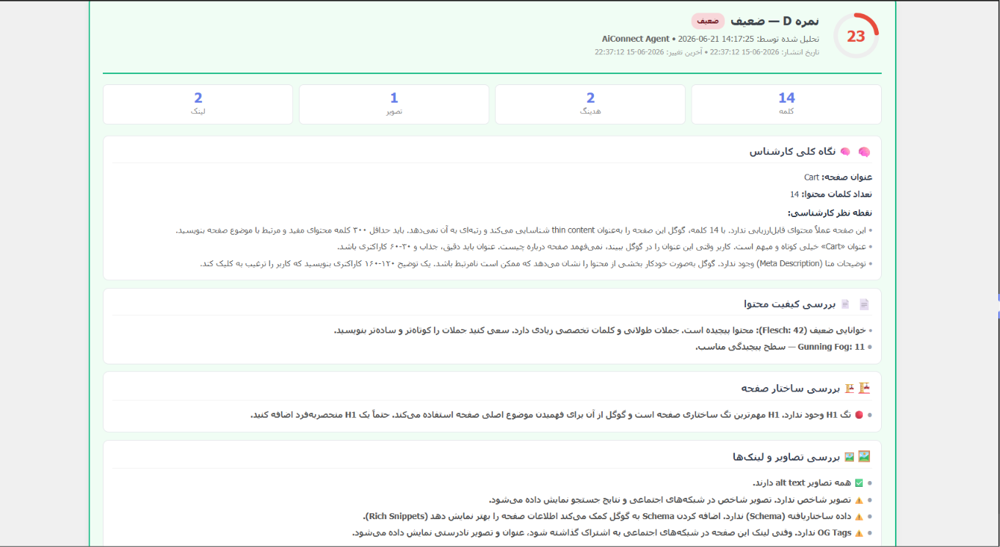
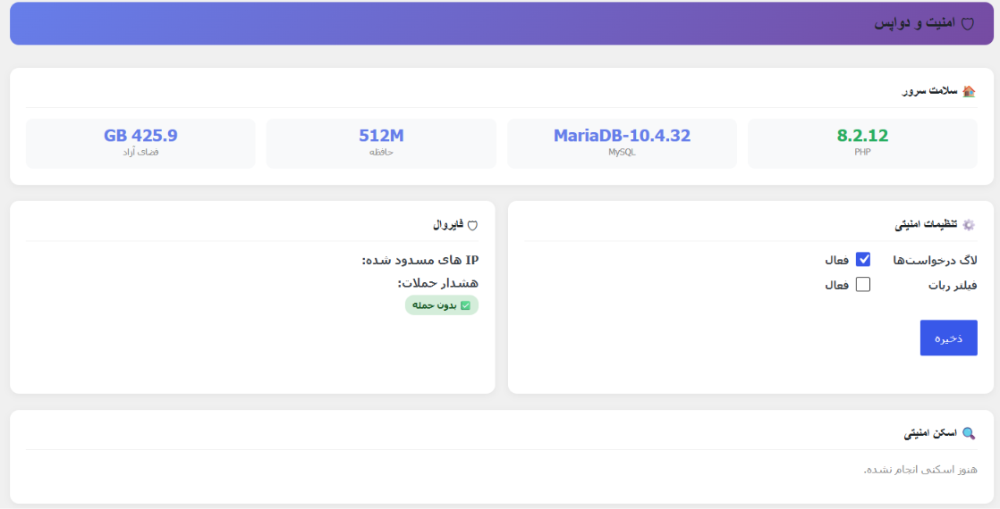
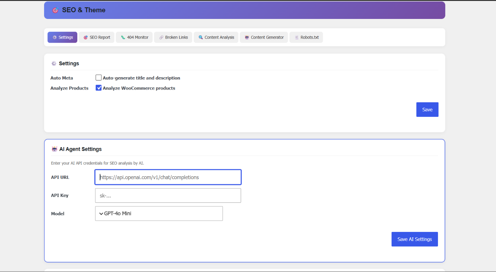

<div align="center">

# AI Connect Pro

### Complete AI Integration for WordPress

[](https://wordpress.org)
[](https://php.net)
[](https://www.gnu.org/licenses/gpl-2.0.html)
[](https://github.com/Deioces120/ai-connect)


</div>

---

## What is AI Connect Pro?

AI Connect Pro is a powerful WordPress plugin that brings **complete AI integration** to your website. It provides a full REST API, advanced SEO analysis, AI-powered content generation, security tools, and WooCommerce support — all in one plugin.

---

## Screenshots

### Dashboard


- Site statistics (Posts, Pages, Products, Comments, Users)
- API key and connection test
- SEO overview with page scores
- WooCommerce store stats
- Quick access buttons

### SEO Analysis


- Meta title and description analysis
- Content readability scores (Flesch, Gunning Fog, Coleman-Liau)
- Heading hierarchy check
- Internal/External link analysis
- Image alt text verification

### AI Agent Analysis


- AI-powered page scoring (A/B/C/D grade)
- Expert content review
- Page structure analysis
- Images and links review
- Actionable recommendations

### Security & DevOps


- Server health monitoring
- Firewall with IP blocking
- Security settings (logging, bot filtering)
- Security scanning

### SEO & Theme Settings


- Auto meta generation
- WooCommerce product analysis
- AI Agent configuration (GPT-4o, GPT-4, GPT-3.5)
- Multiple SEO tools tabs

---

## Features

| Feature | Description |
|---------|-------------|
| 🔗 **REST API** | Full CRUD for posts, pages, media, users, comments, plugins, themes, menus, options, files, database |
| 🎯 **SEO Analysis** | Deep page analysis with scoring (A/B/C/D), meta tags, headings, readability, images, links |
| 🤖 **AI Integration** | Connect to GPT-4o, GPT-4, GPT-3.5 for analysis and content generation |
| 📝 **Content Generation** | Articles, product descriptions, landing pages, FAQ |
| 🔒 **Security** | Rate limiting, IP filtering, security scanning, firewall, 404 monitoring |
| 🛒 **WooCommerce** | Product management, orders, revenue tracking |
| 🌐 **Multilingual** | Full support for Persian (Farsi) and English |
| 📊 **Analytics** | Site health, content matrix, broken link detection |

---

## Quick Start

### Installation

**Method 1: Upload ZIP**
1. Download `ai-connect.zip`
2. Go to **Plugins > Add New > Upload Plugin**
3. Upload and activate

**Method 2: Manual**
1. Copy `ai-connect` folder to `wp-content/plugins/`
2. Activate from **Plugins** page

### First Steps
After activation:
- ✅ AI Connect Theme is auto-activated
- ✅ API key is auto-generated
- ✅ Shop page is created (if WooCommerce is installed)
- ✅ Default language is Persian

---

## API Documentation

### Base URL
```
https://your-site.com/wp-json/ai-connect/v1/
```

### Authentication
```bash
# Header
X-API-Key: YOUR_API_KEY

# Or query parameter
?api_key=YOUR_API_KEY
```

### Quick Examples

**Test Connection:**
```bash
curl -s "https://your-site.com/wp-json/ai-connect/v1/ping"
```

**Get Posts:**
```bash
curl -s -H "X-API-Key: YOUR_KEY" \
  "https://your-site.com/wp-json/ai-connect/v1/posts"
```

**Create Post:**
```bash
curl -s -X POST \
  -H "X-API-Key: YOUR_KEY" \
  -H "Content-Type: application/json" \
  -d '{"title":"My Post","content":"<p>Hello</p>","status":"publish"}' \
  "https://your-site.com/wp-json/ai-connect/v1/posts"
```

**Analyze SEO:**
```bash
curl -s -H "X-API-Key: YOUR_KEY" \
  "https://your-site.com/wp-json/ai-connect/v1/seo/analyze/1"
```

**Generate Content:**
```bash
curl -s -X POST \
  -H "X-API-Key: YOUR_KEY" \
  -H "Content-Type: application/json" \
  -d '{"topic":"WordPress SEO","content_type":"article","word_limit":800}' \
  "https://your-site.com/wp-json/ai-connect/v1/seo/generate-content"
```

### API Endpoints

| Method | Endpoint | Description |
|--------|----------|-------------|
| GET | `/ping` | Test connection |
| GET/POST | `/posts` | Manage posts |
| GET/POST | `/pages` | Manage pages |
| GET/POST | `/media` | Media library |
| GET/POST | `/comments` | Comments |
| GET | `/users` | Users |
| GET/POST | `/products` | WooCommerce products |
| GET | `/orders` | WooCommerce orders |
| GET | `/plugins` | Plugins |
| GET | `/themes` | Themes |
| GET/POST | `/menus` | Menus |
| GET/POST | `/options` | WordPress options |
| GET/POST | `/files` | File system |
| POST | `/db/query` | SQL queries |
| GET | `/seo/analyze/{id}` | SEO analysis |
| GET | `/seo/scores` | All page scores |
| GET | `/seo/site-health` | Site health |
| POST | `/seo/generate-content` | AI content generation |
| GET | `/analytics/summary` | Analytics summary |
| POST | `/devops/scan` | Security scan |

---

## AI Setup

### Configure AI Agent
1. Go to **AI Connect > SEO & Theme > Settings**
2. Enter your AI API credentials:
   - **API URL:** `https://api.openai.com/v1/chat/completions`
   - **API Key:** Your OpenAI API key
   - **Model:** GPT-4o, GPT-4o Mini, GPT-4 Turbo, or GPT-3.5 Turbo
3. Save settings

### Auto SEO Analysis
1. Go to **AI Connect > SEO & Theme > SEO Report**
2. Click on a page
3. Click **"Auto Analyze"** button
4. AI will analyze the content and provide recommendations

---

## Language Support

### Persian (Farsi) 🇮🇷
- Full RTL (Right-to-Left) support
- All admin panel texts in Persian
- Default font: Tahoma

### English 🇺🇸
- Full LTR (Left-to-Right) support
- All admin panel texts in English

### Change Language
1. Go to **AI Connect > Language**
2. Select your preferred language
3. Save

---

## Security Notes

1. **Keep your API key secret** - Never expose it in public code
2. **Use HTTPS** - All API communication should be over HTTPS
3. **Set IP restrictions** - Limit access to specific IPs in production
4. **Enable rate limiting** - Prevent abuse
5. **Disable SQL access** - Turn off `/db/query` endpoint in production

---

## Requirements

- WordPress 5.0+
- PHP 7.4+
- MySQL 5.6+
- PHP memory: 128MB minimum (256MB recommended)

### Optional
- WooCommerce (for store features)
- cURL (for broken link checking)
- OpenAI account (for AI analysis and content generation)
- Pexels API key (for free image search)

---

## Contributing

1. Fork the repository
2. Create feature branch: `git checkout -b feature/my-feature`
3. Commit changes
4. Push and create Pull Request

---

## License

GPL v2 - [View License](https://www.gnu.org/licenses/gpl-2.0.html)

---

## Author

**Deioces120** 

---

<div align="center">

If this plugin is helpful, please give it a ⭐ on GitHub!

</div>

---

# [فارسی / Persian]</div>

## AI Connect Pro چیست؟

افزونه AI Connect Pro یک ابزار قدرتمند برای وردپرس است که **اتصال کامل هوش مصنوعی** را به سایت شما می‌آورد. این افزونه یک REST API جامع، تحلیل سئوی پیشرفته، تولید محتوا با AI، ابزارهای امنیتی و پشتیبانی از ووکامرس را در یک پکیج واحد ارائه می‌دهد.

---

## اسکرین‌شات‌ها

### داشبورد


- آمار کلی سایت (نوشته، صفحه، محصول، دیدگاه، کاربر)
- کلید API و تست اتصال
- نمای کلی سئو با امتیاز صفحات
- آمار فروشگاه ووکامرس
- دسترسی سریع

### تحلیل سئو


- بررسی عنوان و توضیحات متا
- امتیازات خوانایی محتوا (Flesch، Gunning Fog، Coleman-Liau)
- بررسی ساختار هدینگ
- تحلیل لینک‌های داخلی و خارجی
- بررسی alt text تصاویر

### تحلیل AI Agent


- امتیازدهی صفحه توسط هوش مصنوعی (A/B/C/D)
- بررسی تخصصی محتوا
- تحلیل ساختار صفحه
- بررسی تصاویر و لینک‌ها
- پیشنهادات عملیاتی

### امنیت و دواپس


- مانیتورینگ سلامت سرور
- فایروال با مسدودسازی IP
- تنظیمات امنیتی (لاگ‌گیری، فیلتر ربات)
- اسکن امنیتی

### تنظیمات SEO و قالب


- ساخت خودکار متا
- تحلیل محصولات ووکامرس
- پیکربندی AI Agent (GPT-4o، GPT-4، GPT-3.5)
- تب‌های ابزارهای سئو

---

## امکانات

| ویژگی | توضیح |
|--------|--------|
| 🔗 **REST API** | مدیریت کامل نوشته، صفحه، رسانه، کاربر، افزونه، قالب، منو و... |
| 🎯 **تحلیل سئو** | تحلیل عمیق صفحات با نمره‌دهی A/B/C/D |
| 🤖 **هوش مصنوعی** | اتصال به GPT-4o برای تحلیل و تولید محتوا |
| 📝 **تولید محتوا** | مقاله، توضیحات محصول، لندینگ پیج، FAQ |
| 🔒 **امنیت** | Rate Limiting، فیلتر IP، اسکن امنیتی |
| 🛒 **ووکامرس** | مدیریت محصولات و مشاهده آمار فروش |
| 🌐 **چند زبانه** | پشتیبانی کامل از فارسی و انگلیسی |

---

## نصب سریع

### روش ۱: آپلود فایل ZIP
1. فایل `ai-connect.zip` را دانلود کنید
2. به **افزونه‌ها > افزودن > بارگذاری افزونه** بروید
3. فایل را آپلود و فعال کنید

### روش ۲: نصب دستی
1. پوشه `ai-connect` را در مسیر `wp-content/plugins/` کپی کنید
2. افزونه را از بخش **افزونه‌ها** فعال کنید

### تنظیمات اولیه
پس از فعال‌سازی:
- ✅ قالب AI Connect به صورت خودکار فعال می‌شود
- ✅ کلید API به صورت خودکار تولید می‌شود
- ✅ صفحه فروشگاه ساخته می‌شود (در صورت نصب ووکامرس)
- ✅ زبان پیش‌فرض فارسی است

---

## مستندات API

### آدرس پایه
```
https://your-site.com/wp-json/ai-connect/v1/
```

### احراز هویت
```bash
# هدر
X-API-Key: YOUR_API_KEY

# یا پارامتر URL
?api_key=YOUR_API_KEY
```

### نمونه درخواست‌ها

**تست اتصال:**
```bash
curl -s "https://your-site.com/wp-json/ai-connect/v1/ping"
```

**دریافت نوشته‌ها:**
```bash
curl -s -H "X-API-Key: YOUR_KEY" \
  "https://your-site.com/wp-json/ai-connect/v1/posts"
```

**ایجاد نوشته:**
```bash
curl -s -X POST \
  -H "X-API-Key: YOUR_KEY" \
  -H "Content-Type: application/json" \
  -d '{"title":"عنوان","content":"<p>محتوا</p>","status":"publish"}' \
  "https://your-site.com/wp-json/ai-connect/v1/posts"
```

**تحلیل سئو:**
```bash
curl -s -H "X-API-Key: YOUR_KEY" \
  "https://your-site.com/wp-json/ai-connect/v1/seo/analyze/1"
```

---

## پشتیبانی زبان

### فارسی 🇮🇷
- پشتیبانی کامل RTL (راست به چپ)
- تمام متون پنل مدیریت فارسی
- فونت پیش‌فرض: Tahoma

### انگلیسی 🇺🇸
- پشتیبانی کامل LTR (چپ به راست)
- تمام متون پنل مدیریت انگلیسی

### تغییر زبان
1. به **AI Connect > زبان** بروید
2. زبان مورد نظر را انتخاب کنید
3. ذخیره کنید

---

## نکات امنیتی

1. **کلید API را مخفی نگه دارید**
2. **از HTTPS استفاده کنید**
3. **محدودیت IP تنظیم کنید**
4. **Rate Limit را فعال نگه دارید**

---

## نیازمندی‌ها

- وردپرس 5.0 یا بالاتر
- PHP 7.4 یا بالاتر
- MySQL 5.6 یا بالاتر
- حافظه PHP حداقل 128MB

---

## لایسنس

GPL v2

---

## نویسنده

**Deioces120** 
